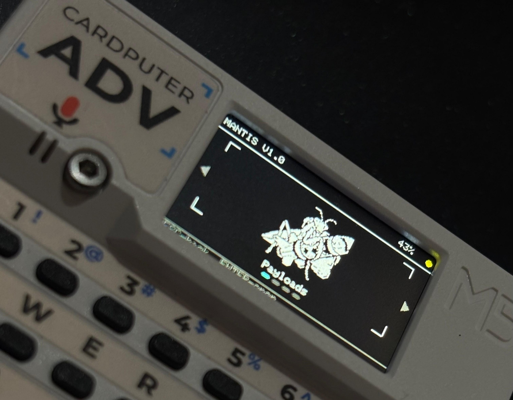

<p align="center">
  
</p>

# MantisHID+MSC

<p align="center">
  
  
  
  
  
  
</p>

**Composite USB automation and virtual-storage firmware for the M5Stack Cardputer ADV, combining Keyboard HID, Mouse HID, Consumer Control HID, and Mass Storage Class through one USB connection.**

MantisHID+MSC turns the ESP32-S3 into a composite USB device named **MantisUSB**. The host can mount a FAT32 virtual drive while the Cardputer executes compatible DuckyScript payloads using the selected keyboard layout.

> **WARNING:** Use MantisHID+MSC only on computers and systems that you own or are explicitly authorized to test. You are responsible for complying with all applicable laws, policies, and agreements.

## Contents

- [Main features](#main-features)
- [Supported hardware (currently)](#supported-hardware-currently)
- [Installation / flashing](#installation--flashing)
- [Storage modes](#storage-modes)
- [SD card setup](#sd-card-setup)
- [Payloads](#payloads)
- [Keyboard layouts](#keyboard-layouts)
- [Supported DuckyScript commands](#supported-duckyscript-commands)
- [Mantis DuckyScript 3 Core](#mantis-duckyscript-3-core)
- [Safety limits (currently)](#safety-limits-currently)
- [Documentation](#documentation)
- [Disclaimer](#disclaimer)
- [License](#license)

## Main features

- Composite USB device based on the ESP32-S3 TinyUSB stack.
- **Keyboard HID** for compatible DuckyScript keyboard injection.
- **Mouse HID** for pointer movement, clicks, drag operations, and scrolling.
- **Consumer Control HID** for volume, media, brightness, and compatible navigation actions.
- **Mass Storage Class (MSC)** with a removable FAT32 virtual drive.
- Fixed USB product identity: **MantisUSB**.
- Classic DuckyScript 1.x compatibility with supported Flipper BadUSB-style extensions.
- Mantis DuckyScript 3 Core with variables, constants, expressions, conditions, loops, and basic functions.
- Built-in `US`, `ES`, and `LATAM` layouts plus external `.kl` keyboard-layout files.
- IMG storage mode with automatic `MANTISUSB.IMG` capacity detection.

## Supported hardware (currently)

<p align="center">
  
</p>

| Target | Status | PlatformIO environment |
|---|---|---|
| **M5Stack Cardputer ADV** | Officially tested and supported | `m5stack-cardputer-adv` |
| **M5Stack Cardputer** | Compatibility target; physical validation pending | To be added |

## Installation / flashing

Flash a compatible release binary using an ESP32-S3 flashing utility, such as Espressif Flash Download Tool, a supported browser-based flasher, or another compatible method. A detailed M5Burner installation guide will be added in a future documentation update.

## Storage modes

### IMG mode — recommended and source included

IMG mode exposes a FAT32 virtual drive stored as `MANTISUSB.IMG` on the physical microSD card. The firmware detects and validates the image capacity automatically at startup.

- **500 MiB is the officially tested, recommended, and supported capacity for MANTIS V1.0.**
- Other image sizes can be generated without recompiling the firmware.
- IMG mode normally provides faster and more predictable drive detection than exposing a large physical card directly.

### RAW SD mode — full physical capacity, release binary only

The RAW SD variant exposes the complete physical microSD capacity and uses a different storage backend.

- It does not require `MANTISUSB.IMG`.
- Drive detection and free-space calculation can be significantly slower.
- Safe removal is especially important.
- It is distributed as a separate precompiled Release asset.

## SD card setup

The repository includes:

```text
sd_card/
├── USB_IMG/
│   ├── MANTISUSB_500MB.img.zip
│   └── SHA256_MANTISUSB_500MB.txt
└── MantisSD/
    ├── Payloads/
    ├── Settings/
    └── Layouts/
```

### IMG mode setup

1. Format the physical microSD card using an MBR partition table and FAT32 filesystem.
2. Extract `sd_card/USB_IMG/MANTISUSB_500MB.img.zip`.
3. Copy `MANTISUSB.IMG` to the **root of the physical microSD card**.
4. Insert the microSD card into the Cardputer ADV.
5. Start the flashed firmware and connect the Cardputer ADV to the computer.
6. Wait for the virtual **MANTISUSB** drive to appear.
7. Copy the complete `sd_card/MantisSD/` folder into the **root of the mounted MANTISUSB drive**.
8. On the Cardputer, open **USB Drive** and press **R**.
9. Safely eject **MANTISUSB** from the computer when requested.
10. Wait for payload and keyboard-layout synchronization to finish.

> **WARNING:** In IMG mode, do not place `MantisSD` next to `MANTISUSB.IMG` on the physical card. Copy `MantisSD` into the mounted virtual **MANTISUSB** drive after the firmware exposes the image.

> **WARNING:** If you are using the RAW SD release without `.IMG`, ignore the image-copy steps and place the complete `MantisSD` folder directly in the root of the physical microSD card.

See [`sd_card/README.md`](sd_card/README.md) for the concise SD-only instructions.

## Payloads

Place supported scripts in `MantisSD/Payloads/`.

| Extension | Purpose |
|---|---|
| `.txt` | Classic text payload |
| `.duck` | DuckyScript-compatible payload |
| `.ds` | DuckyScript or Mantis DuckyScript 3 Core payload |

## Keyboard layouts

| Layout source | Location | Notes |
|---|---|---|
| Built in | Firmware | `US`, `ES`, and `LATAM` |
| External | `MantisSD/Layouts/*.kl` | Each file must be exactly 256 bytes |

After copying external layouts, press `R`, eject the drive safely, open **Settings → Layout**, select the desired layout, and save it. Text produced by `STRING` and `STRINGLN` uses the selected layout.

## Supported DuckyScript commands

MantisHID+MSC supports the complete classic **DuckyScript 1.x** command set used by the firmware, together with the implemented **Flipper BadUSB-style extensions** for keyboard input, delays, repetition, Alt codes, SysRq, physical-button waits, Mouse HID, Consumer Control HID, keyboard layouts, and compatibility aliases.

For the exact command names, aliases, behavior, and current limitations, see [DuckyScript compatibility](docs/duckyscript-compatibility.md).

## Mantis DuckyScript 3 Core

Mantis executes a DuckyScript 3-inspired core directly on the Cardputer. It does not require a desktop compiler.

| Supported syntax |
|---|
| `VAR $NAME = value` |
| `DEFINE $NAME value` |
| `$COUNT = ($COUNT + 1)` |
| Integer and quoted-string values |
| Arithmetic: `+`, `-`, `*`, `/`, `%` |
| Comparisons: `==`, `!=`, `<`, `<=`, `>`, `>=` |
| Logic: `AND`, `OR`, `NOT` |
| Conditions: `IF`, `ELSE_IF`, `ELSE`, `END_IF` |
| Loops: `WHILE`, `END_WHILE` |
| Functions: `FUNCTION`, `END_FUNCTION`, calls, `RETURN` |
| Variable expansion inside supported classic commands |

## Safety limits (currently)

| Limit | V1.0 value |
|---|---:|
| Classic payload lines | 2,048 |
| Characters per text line | 500 |
| `DELAY` per instruction | 30,000 ms |
| Default delay | 0–2,000 ms |
| `REPEAT` count | 1–1,000 |
| Conditional waits | 32 |
| Declared wait budget | 600 seconds |
| DuckyScript 3 Core variables | 64 |
| DuckyScript 3 Core functions | 32 |
| DuckyScript 3 Core nesting depth | 12 |
| Loop iterations | 1,000 |
| Function calls | 256 |

## Documentation

- [Architecture](docs/architecture.md)
- [Storage modes](docs/storage-modes.md)
- [DuckyScript compatibility](docs/duckyscript-compatibility.md)
- [Keyboard layouts](docs/keyboard-layouts.md)
- [Hardware support](docs/hardware-support.md)
- [Troubleshooting](docs/troubleshooting.md)
- [Release assets](docs/release-assets.md)
- [Validation report](docs/validation.md)

## Disclaimer

MantisHID+MSC is intended for education, development, and authorized security testing. The authors are not responsible for unauthorized use, data loss, device damage, or legal consequences. The software is provided without warranty; see the MIT License for details.

## License

Original MantisHID+MSC source code and documentation are licensed under the **MIT License**. See [`LICENSE`](LICENSE).

Third-party libraries, tools, trademarks, and bundled keyboard-layout data retain their respective licenses and notices. See [`THIRD_PARTY_NOTICES.md`](THIRD_PARTY_NOTICES.md) and the files under [`LICENSES/`](LICENSES/).
